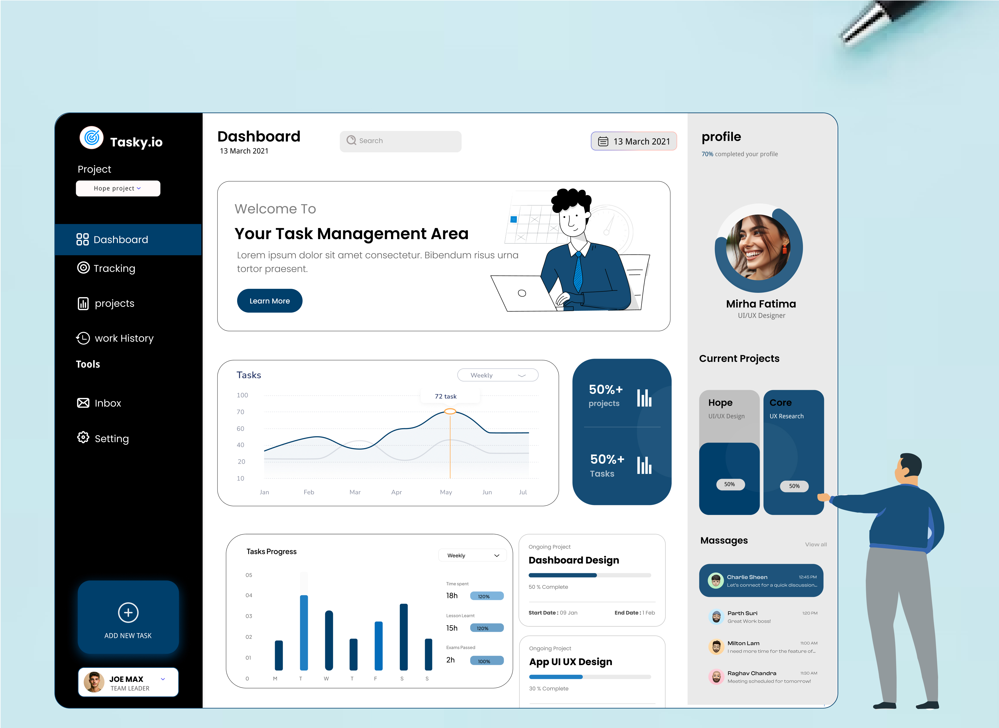
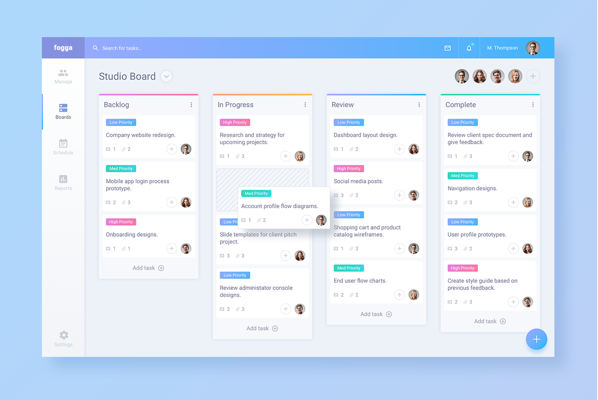
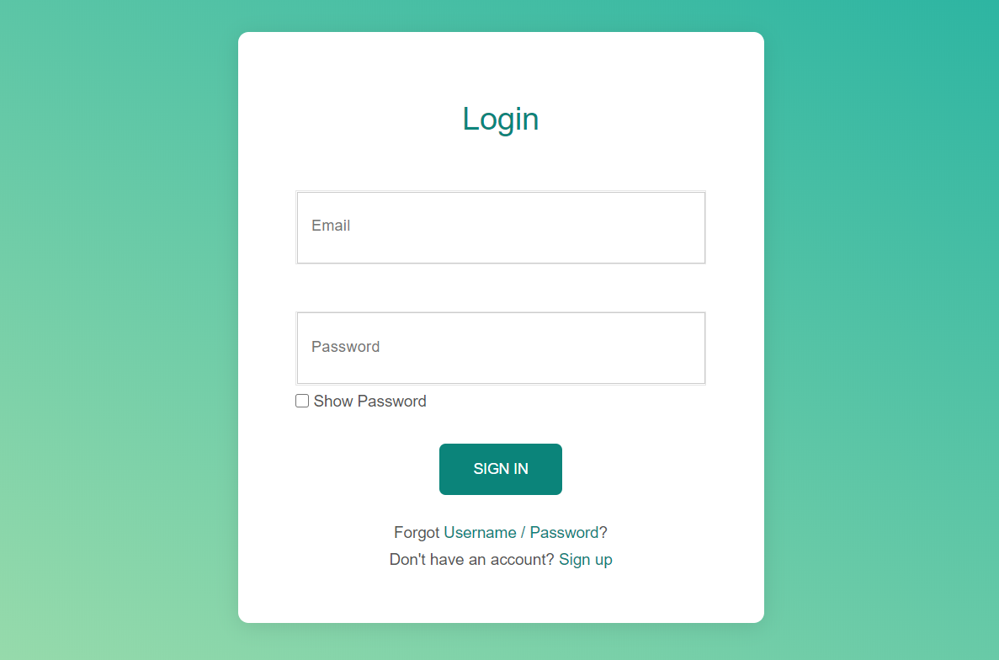
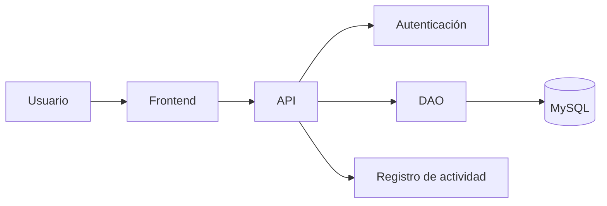

# TaskFlow

### El sistema inteligente para la gestión de actividades en equipo

## Tabla de contenidos
- [Descripción](#descripción)
- [Funcionalidades Principales](#funcionalidades-principales)
- [Tecnologías Utilizadas](#tecnologías-utilizadas)
- [Requisitos del Sistema](#requisitos-del-sistema)
- [Estado de Funcionalidades (Checklist)](#estado-de-funcionalidades-checklist)
- [Instalación](#instalación)

## Descripción
TaskFlow es una aplicación diseñada para optimizar y administrar las tareas diarias de un equipo de desarrollo. Permite centralizar las asignaciones de trabajo, monitorear los avances en tiempo real y mejorar la productividad colectiva mediante una interfaz intuitiva y colaborativa.

## Funcionalidades Principales
* Creación y asignación de tareas individuales y grupales.
* Monitoreo del estado de avance de los proyectos mediante tableros visuales.
* Notificaciones automáticas de fechas límite y entregas pendientes.
* Reportes semanales de rendimiento del equipo.

## Tecnologías Utilizadas
A continuación se detalla la tabla técnica de los componentes tecnológicos del ecosistema de la aplicación:

| Componente | Tecnología | Propósito Técnico |
| :--- | :--- | :--- |
| **Frontend** | React / HTML5 / CSS3 | Construcción de la interfaz de usuario interactiva y responsive. |
| **Backend** | Node.js / Express | Arquitectura de API REST para procesar la lógica de negocio. |
| **Base de Datos** | MySQL | Almacenamiento relacional y persistencia de datos del equipo. |
| **Control de Versiones** | Git y GitHub | Gestión colaborativa del código fuente y documentación. |

## Requisitos del Sistema
Para poder ejecutar esta aplicación en tu entorno local, necesitas tener instalado:
* Node.js (versión 18.0 o superior)
* Servidor MySQL activo en el puerto 3306
* Un navegador web moderno (Chrome, Edge o Firefox)

## Estado de Funcionalidades (Checklist)
A continuación se detalla el progreso actual del desarrollo del proyecto:

- [x] Registrar tareas
- [x] Editar tareas
- [ ] Eliminar tareas
- [ ] Asignar tareas a usuarios

## Instalación
Sigue estos pasos detallados para configurar y desplegar el proyecto en tu entorno local:

1. Clonar el repositorio.
2. Configurar la base de datos.
3. Configurar las variables necesarias.
4. Ejecutar la aplicación.

## Capturas de pantalla
A continuación se muestran las interfaces principales del sistema, organizadas en el directorio de documentación del proyecto:

### 🖥️ Pantalla Principal

### 📊 Panel de Gestión de Tareas

### 🔑 Formulario de Acceso / Login

## Arquitectura
La aplicación está organizada en diferentes componentes que permiten gestionar la interacción con el usuario, la autenticación, el acceso a datos y el registro de actividades.

## Contribuidores
El diseño de la interfaz, la estructuración de la documentación técnica y el control de versiones para este repositorio han sido desarrollados de forma individual por:

* **Lucero Julca** - [Lucero10-20](https://github.com/Lucero10-20) - *Desarrolladora de Software Principal*

## Licencia
Este proyecto está bajo la Licencia **MIT**. Esto significa que es un software de código abierto y libre, permitiendo a cualquier estudiante de utilizar, modificar y distribuir el código base para fines académicos. Puedes consultar los términos detallados en el repositorio oficial.
